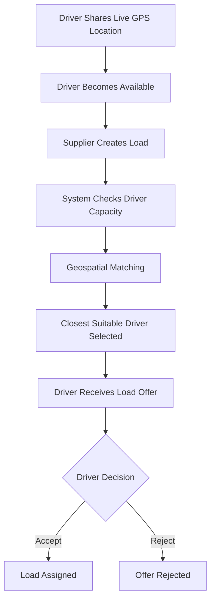

# Team Name: Infinite Loop

## Members

| Name            | Email                                                                 | GitHub                                        |
| --------------- | --------------------------------------------------------------------- | --------------------------------------------- |
| Madhav S Pillai | [madhavsp05@gmail.com](mailto:madhavsp05@gmail.com)                   | [0MadGaming0](https://github.com/0MadGaming0) |
| Allan Varghese  | [allanvarghese2004@gmail.com](mailto:allanvarghese2004@gmail.com)     |                                               |
| Sreenandana     | [sreenandanaanil2004@gmail.com](mailto:sreenandanaanil2004@gmail.com) |                                               |

## Project Name

**Load n Go (CoLoad)**

## Goal / Problem Statement

Load n Go connects suppliers with truck drivers through **real-time geospatial matching**. A supplier creates a freight load, while the system identifies the **closest available driver with sufficient vehicle capacity**. Drivers can then review and accept or reject the load offer.

The MVP demonstrates the complete logistics workflow from **driver location sharing → load creation → intelligent driver matching → driver acceptance/rejection**.

## Tech Stack

* **Frontend:** HTML5, Vanilla CSS3, JavaScript (ES6+), Firebase SDK
* **Backend:** Node.js, Express.js REST API
* **Database:** MongoDB Native Driver with `2dsphere` indexing and `$geoNear`
* **Fallback:** Self-contained in-memory demo store when MongoDB is unavailable
* **Authentication:** Firebase Auth / SMS OTP
* **Storage:** Firebase Cloud Storage
* **AI:** Ollama with `qwen3:4b` for optional cargo and supplier insights

## Features & Implemented Flow



### 1. Live Driver Location

* Driver shares their current GPS location.
* Location is stored with the driver's availability and vehicle capacity.
* MongoDB uses a `2dsphere` index for spatial queries.

### 2. Load Creation

* Supplier creates a freight/load request.
* Required information such as pickup location, destination, cargo details, and required capacity is recorded.

### 3. Intelligent Driver Matching

* The backend searches for available drivers within a **100 km radius**.
* Drivers are filtered based on:

  * Distance from pickup location
  * Vehicle capacity
  * Availability
  * Location freshness
* MongoDB `$geoNear` is used when MongoDB is available.

### 4. Driver Offer

* The closest suitable driver receives the load offer.
* Driver can **Accept** or **Reject** the offer.
* On acceptance, the load and driver are marked as assigned.

### 5. AI Cargo & Supplier Insights

* Drivers can select **Know More** to request an AI-generated summary.
* Ollama analyzes available supplier and cargo information and provides a concise compliance/safety brief.

## Demo Flow

1. Sign in as a driver using a valid-format phone number.
2. Use OTP `123456` in demo mode.
3. Share the driver's GPS location.
4. Sign out and sign in as the supplier:

   * **Email:** `supplier@coload.demo`
   * **OTP:** `123456`
5. Create a freight load.
6. The system finds the closest suitable driver.
7. Send the load offer.
8. Return to the driver dashboard.
9. Accept or reject the offer.
10. On acceptance, both dashboards show the assigned state.

For the live demonstration, use **two browser profiles**—one for the driver and one for the supplier.

## Demo Video

(https://drive.google.com/file/d/1M46OGMkDOjxrj4yvtiU3Jl7ERNojUwwV/view?usp=sharing)

## Screenshots

See the `photos/` folder for project screenshots.

---

# How to Run

### 1. Clone the Repository

```bash
git clone https://github.com/0MadGaming0/Kraft_night_2026.git
cd Kraft_night_2026/Allan/Backend
npm install
```

### 2. Configure Environment

Create `.env` inside `Backend/`:

```env
PORT=5000

MONGODB_URI=mongodb://localhost:27017

MONGODB_DB=loadngo

DEMO_MODE=true
```

### 3. Start the Server

```bash
npm start
```

Or:

```bash
npm run dev
```

Open:

```text
http://localhost:5000
```

### Database Fallback

MongoDB is **not required for the basic demonstration**. If MongoDB is unavailable, the backend automatically uses an **in-memory demo store**, allowing the complete workflow to remain functional.

When MongoDB is available, the system uses:

```text
drivers.currentLocation → 2dsphere index → $geoNear → nearest suitable driver
```

### 4. Optional Ollama AI

Install Ollama and run:

```bash
ollama run qwen3:4b
```

The application connects to:

```text
http://127.0.0.1:11434
```

If Ollama is unavailable, the main logistics workflow continues without the AI feature.
