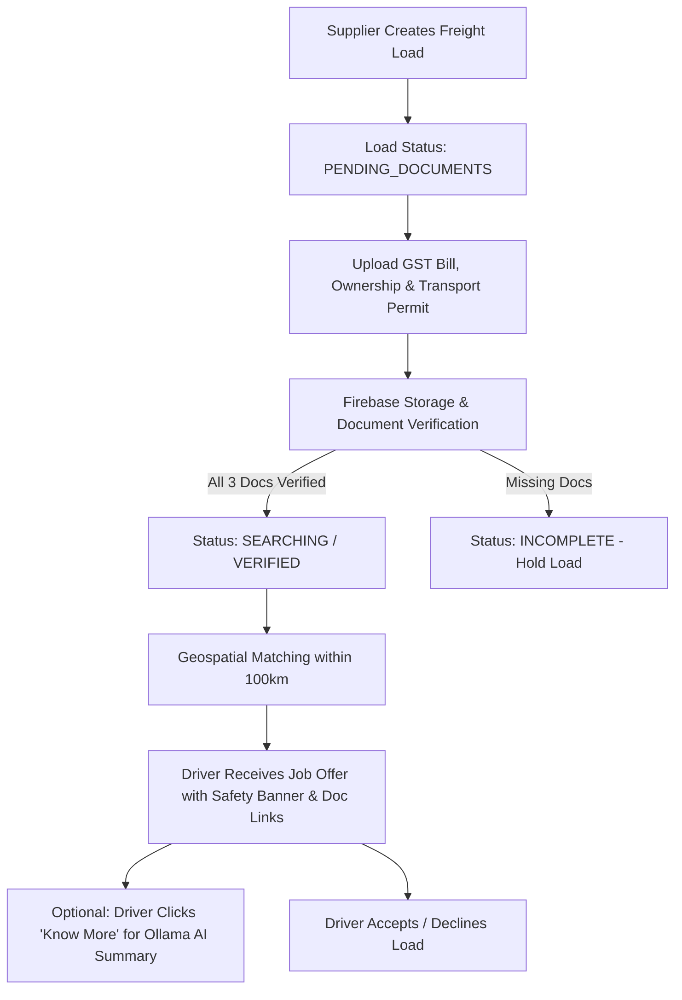

# Team Name: Allan

## Members
| Name | Email | GitHub |
|------|-------|--------|
| Madhav S Pillai | madhavsp05@gmail.com | [0MadGaming0](https://github.com/0MadGaming0) |
| Allan Varghese | allanvarghese2004@gmail.com | |
| Sreenandana | sreenandanaanil2004@gmail.com | |

## Project Name
**Load n Go (CoLoad)**

## Goal / Problem Statement
Load n Go bridges the gap between suppliers and truck drivers by offering intelligent, real-time geospatial matching, document verification safety gating, and AI-driven cargo compliance insights. It solves logistics safety and vehicle capacity underutilization by ensuring only verified, compliant loads are matched with eligible drivers in real time.

## Tech Stack
* **Frontend:** HTML5, Vanilla CSS3 (Glassmorphism UI), JavaScript (ES6+), Firebase SDK v10 (Auth & Storage)
* **Backend:** Node.js, Express.js REST API
* **Database & Geospatial:** MongoDB Native Driver (with `2dsphere` spatial indexing & `$geoNear` aggregation) / In-Memory Demo Fallback
* **Authentication:** Firebase Auth (Supplier) & 2Factor SMS OTP (Driver)
* **Storage:** Firebase Cloud Storage (Transport Document Storage)
* **AI Engine (Optional / Local):** Ollama (`qwen3:4b` model) for automated supplier background & cargo safety briefs

## Features & Implemented Flow



1. **Document Verification & Driver Safety Gating:**
   * Suppliers must upload 3 transport documents (**GST Bill / Invoice**, **Goods Ownership Proof**, and **Goods Transport Permit**).
   * Files are stored in Firebase Storage, and URLs are submitted for backend verification.
   * Loads missing documents are flagged as `INCOMPLETE` and **held from drivers**.
   * Eligible drivers see a green **`✅ SAFE — All Documents Verified`** badge along with direct clickable document links.

2. **Geospatial Real-Time Driver Matching:**
   * Uses MongoDB `$geoNear` indexing to match loads with drivers within a 100 km radius based on payload capacity and location freshness.

3. **Ollama AI Cargo & Supplier Insights (Optional Flow):**
   * Drivers can click "Know More" to generate a 4-point AI compliance summary analyzing supplier registration, cargo specs, legal disclaimers, and required verification.

---

## Demo Video
*(Add your demo video link here)*

## Screenshots
See the `photos/` folder in this directory for working screenshots/photos of the project.

---

## How to Run

### 1. Prerequisites & Installation
```bash
git clone https://github.com/0MadGaming0/Kraft_night_2026.git
cd Kraft_night_2026/Allan/Backend
npm install
```

### 2. Environment Configuration
Create a `.env` file inside `Allan/Backend/` (or use `.env.example` defaults):
```env
PORT=5000
MONGODB_URI=mongodb://localhost:27017
MONGODB_DB=loadngo
DEMO_MODE=true
```

### 3. Run Server
```bash
npm start
# or for development
npm run dev
```
Open `http://localhost:5000` in your browser.

> [!NOTE]
> **Database Fallback:** If MongoDB is not connected, the server automatically falls back to an in-memory store so all features remain demonstrable out of the box.

### 4. Ollama AI Setup Flow (Optional)
To enable the "Know More" AI summary feature for drivers:
1. Install [Ollama](https://ollama.com/).
2. Pull and start the Qwen 3:4B model:
   ```bash
   ollama run qwen3:4b
   ```
3. Ensure Ollama is running locally at `http://127.0.0.1:11434`.
*(If Ollama is not running, the application will display a friendly fallback error without interrupting other features).*
